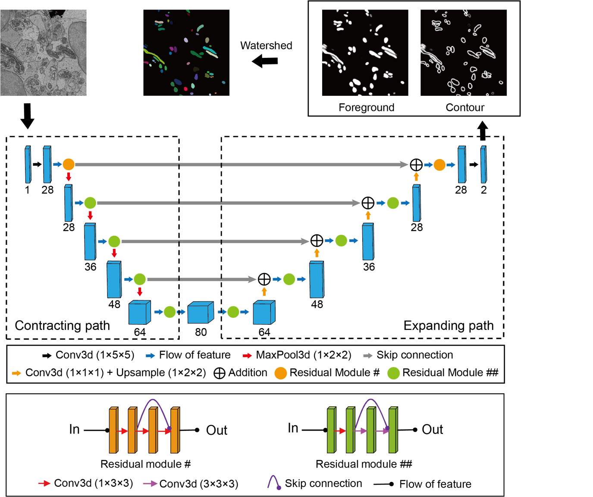

# Mito-ANFs

## 1. Install dependency library (GPU: TITAN RTX 24G Memory)
Pytorch==1.10.1+cu111 
Torchvision==0.11.2+cu111 
Python==3.9.12 
NumPy==1.21.6 
h5py==3.8.0 

## 2. Dataset
Two mid-cochlea datasets at the spatial resolution of 12 × 12 × 50 $nm^3$ (dataset-1: 60 × 55 × 42 $μm^3$, dataset-2: 88 × 46 × 60 $μm^3$) 

[Two training datasets](https://pan.baidu.com/s/1pF2snx4IPPwlRptBL8spkg), each consisting of 1536 × 1536 × 100 voxels. (code: trai)

## 3. Model (mitochondria segmentation)

The model was based on the residual 3D U-Net architecture (Lee et al., 2017). The model code can be downloaded by [pytorch_connectomics](https://github.com/zudi-lin/pytorch_connectomics).

Model parameter: [Weight](https://pan.baidu.com/s/1ygFEJoowlZb588PJW9iMRw)(code: mito)

## 4. Measurement
The volume of mitochondria is the sum of voxels. ANF-associated mitochondria were divided into super voxels with a unit volume of (0.07 $μm^3$) along the longest axis (see code).

## 5. References
Lee, K., Zung, J., Li, P.H., Jain, V., and Seung, H.S. (2017). Superhuman Accuracy on the SNEMI3D Connectomics Challenge. ArXiv abs/1706.00120.
Wei, D., Lin, Z., Franco-Barranco, D., Wendt, N., Liu, X., Yin, W., Huang, X., Gupta, A., Jang, WD., Wang, X., Arganda-Carreras, I., Lichtman, JW., and Pfister, H. (2020). MitoEM Dataset: Large-scale 3D Mitochondria Instance Segmentation from EM Images. Med Image Comput Comput Assist Interv. 12265: 66-76.
Lin, Z., Wei, D., Lichtman, J.W., & Pfister, H. (2021). PyTorch Connectomics: A Scalable and Flexible Segmentation Framework for EM Connectomics. ArXiv, abs/2112.05754.
